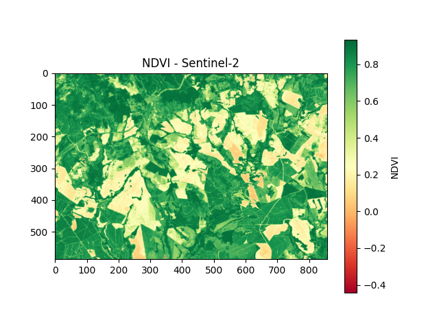

# Vegetation Analysis with NDVI (Sentinel-2)

This project is a proof of concept (PoC) for vegetation vigor analysis using satellite imagery, focusing on data preparation for digital agriculture and AI pipelines.

The workflow uses Sentinel-2 Level-2A imagery to calculate NDVI and generate geospatial maps that support agricultural decision-making and further AI-based analysis.

---

## 📌 Project Overview

Vegetation indices such as NDVI are key features used in predictive models for crop monitoring, yield estimation, stress detection, and digital agriculture systems.

In this project, NDVI was calculated from Sentinel-2 imagery using Google Earth Engine (GEE), and the resulting geospatial data was exported and processed locally in Python for visualization and analysis.

---

Axes represent pixel indices of the raster image; each pixel corresponds to a ground area from Sentinel-2 imagery.

## 🛰️ Data Source

- **Satellite:** Sentinel-2  
- **Product:** Level-2A (Surface Reflectance)  
- **Bands used:**
  - B4 (Red)
  - B8 (Near Infrared – NIR)
- **Platform:** Google Earth Engine  

---

## ⚙️ Methodology

### 1. NDVI calculation (Google Earth Engine)
- Selection of Sentinel-2 Level-2A images
- Cloud filtering
- NDVI calculation:  
  \[
  NDVI = (NIR - Red) / (NIR + Red)
  \]
- Export of NDVI map as GeoTIFF (.tif)

### 2. Local processing and visualization (Python)
- Conversion of GeoTIFF (.tif) to PNG for visualization
- Basic normalization and rendering of vegetation maps
- Support for interpretation and reporting

---

## 🧠 Relation to AI Pipelines

Although this project does not train machine learning models, it focuses on a critical step of AI systems:

> **Data preparation and feature extraction**

NDVI is a common input feature for models used in:
- Crop health monitoring
- Stress detection
- Yield prediction
- Digital agriculture platforms

This project demonstrates the ability to generate high-quality geospatial features for AI-driven agriculture solutions.

---

## 🛠️ Technologies Used

- Google Earth Engine
- Python
- Rasterio
- Matplotlib
- Sentinel-2 Satellite Data
- Remote Sensing

---

## 🚀 Next Steps (Planned)

- Automate NDVI time-series analysis
- Integrate data into AI models for crop monitoring
- Add soil and weather data for multi-source analysis
- Deploy as part of a digital agriculture dashboard

---

## 👤 Author

Gabriel Sousa Martins  
Computer Engineering Student  
Interested in Digital Agriculture, Remote Sensing and AI Systems
